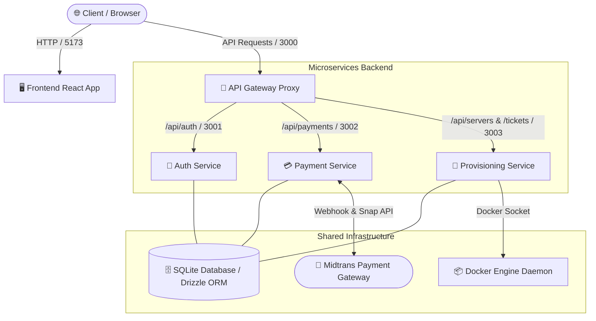

# 🎮 MCloud SaaS — Automated Minecraft Bedrock Hosting Platform

<div align="center">
  
  
  
  
  
  
</div>

---

## 💡 Tentang MCloud SaaS

**MCloud SaaS** adalah platform (*Software-as-a-Service*) penyedia hosting server game **Minecraft Bedrock Edition** yang sepenuhnya otomatis, modern, dan mandiri. Platform ini dibangun di atas arsitektur **Monorepo Microservices** menggunakan Node.js Native HTTP (tanpa framework berat) untuk memberikan performa eksekusi yang sangat cepat (*ultra-fast boot time*), penggunaan memori yang efisien, serta skalabilitas yang tinggi.

Setiap pembelian paket server game oleh pengguna akan diproses secara otomatis melalui *payment gateway* **Midtrans**, dan langsung men-trigger pembuatan kontainer **Docker** independen secara *real-time*.

---

## 🌟 Fitur Utama

### 🕹️ Bagi Pengguna (Player & Server Owner)
- **⚡ Provisi Server Instan**: Server Minecraft Bedrock baru langsung aktif dan siap dimainkan dalam hitungan detik setelah pembayaran dikonfirmasi via Midtrans Snap.
- **🖥️ Panel Kontrol Lengkap**: Start, Stop, dan Restart kontainer server kapan saja langsung dari dasbor web.
- **📈 Live Console & Resource Monitoring**: Pantau *log console* server secara *real-time*, kirim perintah (*command*) langsung ke terminal game, dan pantau statistik penggunaan RAM serta CPU kontainer.
- **📁 Web-Based File Manager**: Lihat, edit, unggah, dan hapus file server (dunia/world, konfigurasi `server.properties`, *addons*, maupun *behavior packs*) tanpa memerlukan klien FTP tambahan.
- **👥 Online Player Management**: Pantau daftar pemain aktif di dalam server dan lakukan tindakan *kick* atau *ban* langsung dari panel kontrol.
- **🎟️ Sistem Tiket Bantuan**: Ajukan tiket bantuan langsung kepada Administrator sistem untuk kendala teknis atau pertanyaan seputar server.

### 🛡️ Bagi Administrator (System Admin)
- **📊 Centralized System Health**: Pantau status kesehatan seluruh mikroservis (API Gateway, Auth, Payment, Provisioning), waktu respons (*latency*), *uptime*, dan jumlah kontainer aktif di dalam Docker Engine secara terpusat.
- **🎛️ Resource Pool Management**: Atur batas maksimal kapasitas RAM global sistem. Pembelian paket baru akan otomatis dinonaktifkan apabila kapasitas server fisik telah mencapai batas maksimal (*sold out*).
- **📦 Manajemen Paket & Transaksi**: Atur harga paket sewa server, berikan diskon, pantau riwayat transaksi seluruh pengguna, dan perpanjang masa aktif server secara manual.
- **👥 Manajemen Akun & Container Cleanup**: Kelola peran (*role*) pengguna dan bersihkan seluruh kontainer/volume Docker milik pengguna yang telah dihapus atau kadaluwarsa dengan satu klik.
- **🚧 Maintenance Mode**: Aktifkan mode pemeliharaan sistem global. Saat aktif, akses publik akan ditutup sementara dan hanya Administrator yang dapat login serta mengakses sistem.

---

## 🏗️ Arsitektur Mikroservis

MCloud dipisahkan menjadi 4 mikroservis backend independen dan 1 aplikasi frontend modern yang dikelola dalam satu monorepo terpadu:



### 📋 Pemetaan Port Service
| Service | Folder | Port | Deskripsi |
| :--- | :--- | :--- | :--- |
| **🔄 API Gateway** | `apps/api-gateway` | `3000` | *Reverse proxy* utama yang mengelola rute permintaan dari klien ke mikroservis yang tepat. |
| **🔐 Auth Service** | `apps/auth-service` | `3001` | Menangani pendaftaran, login, pembuatan/verifikasi token JWT, dan manajemen user admin. |
| **💳 Payment Service** | `apps/payment-service` | `3002` | Integrasi Midtrans Snap, pengolahan *callback webhook*, dan kalkulasi *resource pool*. |
| **🐳 Provisioning Service** | `apps/provisioning-service` | `3003` | Berkomunikasi dengan Docker Daemon untuk membuat, mengelola, dan menginspeksi kontainer game. |
| **🖥️ Frontend App** | `apps/frontend` | `5173` | Dasbor pengguna & admin berbasis React 19, Vite, dan Tailwind CSS. |

---

## 🛠️ Teknologi yang Digunakan

- **Backend Core**: Node.js v20+, Native `node:http` (Zero-dependency routing/server for extreme lightweight footprint).
- **Frontend**: React 19, Vite 8, Tailwind CSS, Lucide Icons, React Router DOM v7.
- **Database & ORM**: SQLite (`better-sqlite3`), Drizzle ORM, Drizzle Kit.
- **Containerization**: Docker Engine API via `unix:///var/run/docker.sock`.
- **Payment Gateway**: Midtrans Client & Server SDK (Snap API).
- **Monorepo Tooling**: Concurrently, dotenv.

---

## 🚀 Quick Start Guide

Berikut adalah langkah cepat untuk menjalankan seluruh ekosistem MCloud di komputer lokal Anda:

### 1. Prasyarat
Pastikan **Node.js (v18/v20+)** dan **Docker Engine** sudah terinstal dan berjalan aktif di sistem Anda.

### 2. Clone & Instalasi
```bash
# Clone repositori
git clone <url-repo-mcloud>
cd mcloud

# Instal dependensi backend root & Drizzle
npm install

# Instal dependensi frontend
npm install --prefix apps/frontend
```

### 3. Konfigurasi Environment
Salin template konfigurasi `.env` dan sesuaikan nilainya bila diperlukan:
```bash
cp .env.example .env
```

### 4. Setup Database & Akun Admin
Sync skema database SQLite dan buat akun Administrator pertama Anda:
```bash
# Push skema database ke SQLite
npm run db:push

# (Opsional) Isi data dummy untuk keperluan development
npm run db:seed:faker

# Buat akun Admin default (admin / 0987654321)
node create_admin.js
```

### 5. Jalankan Ekosistem MCloud
Jalankan Frontend dan ke-4 mikroservis secara bersamaan dalam satu perintah:
```bash
npm run dev
```

Buka browser dan akses aplikasi pada **http://localhost:5173**.  
Akses dasbor administrator dengan login menggunakan akun default:
- **Username**: `admin` (atau email `admin@mcloud.local`)
- **Password**: `0987654321`

---

## 📜 Daftar Perintah (npm scripts)

| Perintah | Keterangan |
| :--- | :--- |
| `npm run dev` | Menjalankan seluruh mikroservis (port 3000-3003) dan frontend Vite (port 5173) secara bersamaan dengan *live watch*. |
| `npm run db:push` | Mendorong perubahan skema Drizzle langsung ke file database SQLite. |
| `npm run db:generate` | Membuat file migrasi SQL baru berdasarkan perubahan di `database/schema.js`. |
| `npm run db:migrate` | Menjalankan migrasi database manual menggunakan script `database/migrate.js`. |
| `npm run db:seed:faker` | Mengisi database dengan data pengujian palsu/dummy (pengguna, server, transaksi). |
| `npm run db:reset:seed` | Menghapus seluruh isi database dan melakukan *seeding* ulang dari awal. |

---

## 📚 Dokumentasi Lanjutan

Untuk panduan teknis yang lebih mendalam seputar arsitektur, spesifikasi produk, dan petunjuk instalasi lengkap, silakan merujuk pada direktori dokumentasi di folder `docs/`:

- **[🔧 Panduan Instalasi & Setup Lengkap](file:///home/shinomiya/coding/projek/mcloud/docs/SETUP.md)** — Instruksi detail instalasi, konfigurasi Docker, spesifikasi environment, dan penyelesaian masalah (*troubleshooting*).
- **[📂 Arsitektur & Struktur Direktori](file:///home/shinomiya/coding/projek/mcloud/docs/STRUKTURE_PROJEK.md)** — Peta struktur direktori monorepo dan pemetaan berkas kode sumber.
- **[📄 Product Requirement Document (PRD)](file:///home/shinomiya/coding/projek/mcloud/docs/PRD.md)** — Spesifikasi produk, alur pengguna, model bisnis, dan skenario penggunaan aplikasi.
- **[✅ Roadmap & SDLC Checklist](file:///home/shinomiya/coding/projek/mcloud/docs/TODO_SDLC.md)** — Daftar rencana pengembangan fitur, tahapan siklus hidup perangkat lunak, dan status implementasi.

---

<div align="center">
  <p>Dibuat dengan ❤️ untuk komunitas Minecraft Bedrock Indonesia.</p>
  <p><b>MCloud SaaS &copy; 2026</b></p>
</div>
