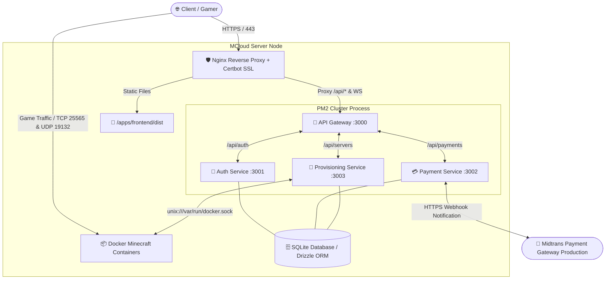

# 🛡️ MCloud SaaS — Production Deployment Guide

Dokumen ini adalah panduan resmi dan komprehensif untuk mengimplementasikan dan menjalankan **MCloud SaaS** di lingkungan **Production** (VPS, Dedicated Server, atau Cloud Instance seperti AWS, DigitalOcean, Google Cloud, atau Biznet Gio). 

Panduan ini mencakup instalasi sistem operasi, konfigurasi **Docker Engine**, pengamanan **Midtrans Snap Production**, otomatisasi mikroservis menggunakan **PM2**, hingga pengaturan **Nginx Reverse Proxy dengan SSL/TLS Let's Encrypt** dan proteksi **Firewall (UFW)**.

---

## 📑 Daftar Isi
1. [Spesifikasi Perangkat Keras & Sistem Operasi](#1-spesifikasi-perangkat-keras--sistem-operasi)
2. [Arsitektur Deployment Production](#2-arsitektur-deployment-production)
3. [Persiapan Sistem & Instalasi Prasyarat](#3-persiapan-sistem--instalasi-prasyarat)
4. [Instalasi Repositori & Build Frontend](#4-instalasi-repositori--build-frontend)
5. [Konfigurasi Environment (.env.production)](#5-konfigurasi-environment-envproduction)
6. [Integrasi Midtrans Snap Production](#6-integrasi-midtrans-snap-production)
7. [Inisialisasi Database & Akun Admin Production](#7-inisialisasi-database--akun-admin-production)
8. [Orkestrasi Mikroservis dengan PM2](#8-orkestrasi-mikroservis-dengan-pm2)
9. [Konfigurasi Nginx Reverse Proxy & SSL (HTTPS)](#9-konfigurasi-nginx-reverse-proxy--ssl-https)
10. [Konfigurasi Firewall (UFW) & Port Game Server](#10-konfigurasi-firewall-ufw--port-game-server)
11. [Otomatisasi Backup Database & Pemeliharaan Docker](#11-otomatisasi-backup-database--pemeliharaan-docker)
12. [Daftar Perintah Pemeliharaan Rutin](#12-daftar-perintah-pemeliharaan-rutin)

---

## 1. Spesifikasi Perangkat Keras & Sistem Operasi

Karena MCloud akan menjalankan kontainer server game Minecraft Bedrock/Java secara *real-time* di dalam node fisik yang sama atau terdistribusi, berikut adalah spesifikasi yang disarankan:

| Spesifikasi | Minimum (Testing/Small SaaS) | Rekomendasi (Production SaaS) |
| :--- | :--- | :--- |
| **Sistem Operasi** | Ubuntu 22.04 / 24.04 LTS | Ubuntu 24.04 LTS / Debian 12 |
| **Prosesor (CPU)** | 2 vCPU Core (Base Clock > 2.5 GHz) | 8+ vCPU Core (High Frequency / AMD Ryzen / Intel Xeon) |
| **Memori (RAM)** | 4 GB RAM | 16 GB - 64 GB RAM DDR4 / DDR5 |
| **Penyimpanan** | 50 GB NVMe SSD | 250 GB+ NVMe SSD Enterprise |
| **Konektivitas** | Public IP Static, 100 Mbps Network | Public IP Static, 1 Gbps Network dengan Proteksi Anti-DDoS |

---

## 2. Arsitektur Deployment Production

Di lingkungan production, seluruh trafik web HTTP/HTTPS dari klien akan diterimakan oleh **Nginx Reverse Proxy**. Nginx akan menyajikan file tĩnh (*static build*) React Vite dan meneruskan permintaan API (`/api/`) serta koneksi WebSocket ke **API Gateway (Port 3000)** yang dikelola oleh **PM2**.



---

## 3. Persiapan Sistem & Instalasi Prasyarat

Jalankan perintah berikut di terminal server Ubuntu/Debian Anda sebagai `root` atau pengguna dengan hak akses `sudo`:

### 3.1. Update Sistem & Instalasi Utilitas Dasar
```bash
sudo apt update && sudo apt upgrade -y
sudo apt install -y curl wget git unzip build-essential ufw nginx certbot python3-certbot-nginx
```

### 3.2. Instalasi Node.js v20 LTS
```bash
# Download dan pasang repositori NodeSource v20
curl -fsSL https://deb.nodesource.com/setup_20.x | sudo -E bash -
sudo apt install -y nodejs

# Verifikasi instalasi
node -v   # Harus v20.x.x
npm -v    # Harus v10.x.x
```

### 3.3. Instalasi Docker Engine & Docker Compose
```bash
# Instal Docker secara otomatis menggunakan script resmi
curl -fsSL https://get.docker.com -o get-docker.sh
sudo sh get-docker.sh

# Aktifkan Docker agar berjalan otomatis saat booting
sudo systemctl enable --now docker

# Tambahkan user saat ini ke dalam grup docker agar tidak perlu 'sudo' saat akses docker socket
sudo usermod -aG docker $USER
newgrp docker

# Verifikasi Docker
docker --version
```

### 3.4. Instalasi PM2 Process Manager
```bash
sudo npm install -g pm2
pm2 --version
```

---

## 4. Instalasi Repositori & Build Frontend

Salin repositori MCloud ke folder produksi standar (misal `/var/www/mcloud` atau `/home/ubuntu/mcloud`):

```bash
# Buat folder dan clone repositori
sudo mkdir -p /var/www
sudo chown -R $USER:$USER /var/www
cd /var/www
git clone <URL_REPOSITORI_MCLOUD_ANDA> mcloud
cd mcloud

# 1. Instal dependensi backend & monorepo
npm install --production=false

# 2. Instal dependensi frontend & lakukan Build Production
cd apps/frontend
npm install
npm run build
cd ../..

# Pastikan folder dist telah terbentuk
ls -la apps/frontend/dist
```

---

## 5. Konfigurasi Environment (`.env.production`)

Buat file konfigurasi `.env` pada akar direktori `/var/www/mcloud/.env`. Jangan gunakan nilai default atau kredensial testing!

```bash
cp .env.example .env
nano .env
```

Isi dengan konfigurasi aman berikut:

```ini
# ==========================================
# MCLOUD SAAS — PRODUCTION ENVIRONMENT
# ==========================================

NODE_ENV=production

# --- Microservices Internal Hosts & Ports ---
GATEWAY_HOST=127.0.0.1
GATEWAY_PORT=3000
GATEWAY_URL=http://127.0.0.1:3000

AUTH_SERVICE_HOST=127.0.0.1
AUTH_SERVICE_PORT=3001
AUTH_SERVICE_URL=http://127.0.0.1:3001

PAYMENT_SERVICE_HOST=127.0.0.1
PAYMENT_SERVICE_PORT=3002
PAYMENT_SERVICE_URL=http://127.0.0.1:3002

PROVISIONING_SERVICE_HOST=127.0.0.1
PROVISIONING_SERVICE_PORT=3003
PROVISIONING_SERVICE_URL=http://127.0.0.1:3003

# --- Public URL & Frontend ---
# Ganti dengan domain utama Anda
FRONTEND_HOST=127.0.0.1
FRONTEND_PORT=5173
FRONTEND_URL=https://mcloud.domainanda.com

# --- Database Storage ---
# Gunakan absolute path agar aman saat dijalankan melalui PM2
DATABASE_URL=/var/www/mcloud/database/sqlite.db

# --- Security & JWT ---
# GENERATE KEY RAHASIA: jalankan `openssl rand -hex 32` di terminal untuk mendapatkan string acak 64 karakter
JWT_SECRET=a8f5f167f44f4964e6c998dee827110c83838272938475610293847561029384
JWT_EXPIRES_IN=24h

# --- Midtrans Payment Gateway (Production) ---
MIDTRANS_IS_PRODUCTION=true
MIDTRANS_SERVER_KEY=Mid-server-YOUR_SERVER_KEY
MIDTRANS_CLIENT_KEY=Mid-client-YOUR_CLIENT_KEY

# --- Provisioning & Docker ---
DOCKER_HOST=unix:///var/run/docker.sock
```

---

## 6. Integrasi Midtrans Snap Production

Agar sistem pembayaran otomatis berfungsi di lingkungan live, lakukan penyesuaian pada **Dashboard Midtrans (Production)**:

1. **Login ke Dasbor Midtrans** ([https://dashboard.midtrans.com/](https://dashboard.midtrans.com/)). Pastikan *toggle* di pojok kanan atas berada pada mode **Production** (bukan Sandbox).
2. Masuk ke menu **Settings -> Access Keys**.
3. Salin **Server Key** dan **Client Key**, lalu tempelkan ke dalam file `.env` di atas.
4. Masuk ke menu **Settings -> Configuration**.
5. Pada bagian **Notification URL (Webhook)**, masukkan endpoint resmi API Gateway MCloud Anda:
   ```http
   https://mcloud.domainanda.com/api/payments/notification
   ```
6. Aktifkan **Finish Redirect URL**, **Unfinish Redirect URL**, dan **Error Redirect URL** dengan nilai:
   ```http
   https://mcloud.domainanda.com/client-area
   ```
7. Klik **Save**. Pastikan saluran pembayaran seperti **QRIS**, **GoPay**, dan **Virtual Account (BCA, Mandiri, BNI, BRI)** telah diaktifkan pada perjanjian kontrak Midtrans Anda.

---

## 7. Inisialisasi Database & Akun Admin Production

Sinkronkan skema SQLite dan buat akun admin pertama untuk server produksi:

```bash
cd /var/www/mcloud

# 1. Sinkronkan skema database (Membuat file /var/www/mcloud/database/sqlite.db)
npm run db:push

# 2. Buat akun Administrator default
node create_admin.js
```

> ⚠️ **TINDAKAN WAJIB KEAMANAN**:  
> Setelah sistem berjalan, **SEGERA LOGIN** ke `https://mcloud.domainanda.com` menggunakan akun default (`admin` / `0987654321`), lalu masuk ke menu **Profil / Pengaturan Admin** untuk **MENGGANTI PASSWORD DEFAULT** dengan kata sandi baru yang sangat kuat!

---

## 8. Orkestrasi Mikroservis dengan PM2

Projek ini telah dilengkapi dengan file `ecosystem.config.js` untuk mengelola proses ke-4 mikroservis secara otomatis di background, mengaktifkan rotasi log, serta mengatur restart otomatis apabila terjadi lonjakan memori atau crash.

### 8.1. Menjalankan Service di PM2
```bash
cd /var/www/mcloud

# Buat folder log jika belum ada
mkdir -p logs

# Jalankan seluruh service menggunakan PM2
pm2 start ecosystem.config.js

# Periksa status seluruh service (Pastikan statusnya 'online')
pm2 list
pm2 status
```

### 8.2. Mengunci Status agar Auto-Start saat Server Reboot
Agar mikroservis otomatis hidup kembali apabila VPS/Server mengalami *reboot* atau mati lampu:
```bash
# 1. Simpan konfigurasi PM2 saat ini
pm2 save

# 2. Generate script startup sistem
pm2 startup
```
*(Salin dan jalankan perintah `sudo env PATH=...` yang dihasilkan oleh terminal PM2 startup di layar Anda).*

---

## 9. Konfigurasi Nginx Reverse Proxy & SSL (HTTPS)

Nginx akan bertindak sebagai garda terdepan untuk melayani frontend dan mem-proxy permintaan API ke port internal `3000`.

### 9.1. Buat File Konfigurasi Nginx
```bash
sudo nano /etc/nginx/sites-available/mcloud
```

Tempelkan konfigurasi profesional berikut (ganti `mcloud.domainanda.com` dengan domain Anda):

```nginx
server {
    listen 80;
    server_name mcloud.domainanda.com;

    # Root folder tempat file statis hasil build Vite berada
    root /var/www/mcloud/apps/frontend/dist;
    index index.html;

    # Logging
    access_log /var/log/nginx/mcloud.access.log;
    error_log /var/log/nginx/mcloud.error.log;

    # 1. Frontend React Routing (Single Page Application Fallback)
    location / {
        try_files $uri $uri/ /index.html;
        add_header Cache-Control "no-cache, no-store, must-revalidate";
    }

    # 2. Cache untuk asset statis gambar/JS/CSS (Optimasi Performa)
    location ~* \.(js|css|png|jpg|jpeg|gif|ico|svg|woff|woff2)$ {
        expires 1y;
        add_header Cache-Control "public, immutable";
    }

    # 3. Reverse Proxy untuk API Gateway MCloud (/api/*)
    location /api/ {
        proxy_pass http://127.0.0.1:3000/api/;
        proxy_http_version 1.1;
        
        # Header standar untuk meneruskan IP asli pengguna ke backend
        proxy_set_header Host $host;
        proxy_set_header X-Real-IP $remote_addr;
        proxy_set_header X-Forwarded-For $proxy_add_x_forwarded_for;
        proxy_set_header X-Forwarded-Proto $scheme;
        
        # Pengaturan Timeout (Penting untuk proses eksekusi Docker yang memakan waktu)
        proxy_connect_timeout 60s;
        proxy_send_timeout 60s;
        proxy_read_timeout 60s;
    }

    # 4. Reverse Proxy Khusus untuk WebSocket Console Server Minecraft (/api/servers/console/*)
    location /api/servers/console/ {
        proxy_pass http://127.0.0.1:3000/api/servers/console/;
        proxy_http_version 1.1;
        
        # Header wajib untuk Upgrade koneksi HTTP ke WebSocket
        proxy_set_header Upgrade $http_upgrade;
        proxy_set_header Connection "Upgrade";
        proxy_set_header Host $host;
        proxy_set_header X-Real-IP $remote_addr;
        
        # Nonaktifkan timeout untuk koneksi terminal yang aktif lama
        proxy_read_timeout 3600s;
        proxy_send_timeout 3600s;
    }
}
```

### 9.2. Aktifkan Konfigurasi & Uji Nginx
```bash
# Hapus default site jika mengganggu
sudo rm -f /etc/nginx/sites-enabled/default

# Buat symbolic link
sudo ln -s /etc/nginx/sites-available/mcloud /etc/nginx/sites-enabled/

# Uji sintaks nginx
sudo nginx -t

# Restart Nginx
sudo systemctl restart nginx
```

### 9.3. Pasang Sertifikat SSL Gratis (Let's Encrypt Certbot)
```bash
sudo certbot --nginx -d mcloud.domainanda.com
```
*(Ikuti instruksi di layar. Pilih opsi **2 (Redirect)** agar seluruh trafik HTTP otomatis dialihkan ke HTTPS yang aman).*

---

## 10. Konfigurasi Firewall (UFW) & Port Game Server

Keamanan server sangat bergantung pada firewall. Kita harus menutup port mikroservis internal (`3000-3003`) dari internet publik, dan hanya membuka port web serta port server game Minecraft Bedrock/Java.

```bash
# 1. Reset aturan UFW ke default (Tolak semua masuk, izinkan semua keluar)
sudo ufw default deny incoming
sudo ufw default allow outgoing

# 2. Izinkan akses SSH (PENTING! Jangan sampai terkunci di luar server)
sudo ufw allow 22/tcp

# 3. Izinkan HTTP dan HTTPS untuk Nginx
sudo ufw allow 80/tcp
sudo ufw allow 443/tcp

# 4. Izinkan Port Game Minecraft (Standar Java & Bedrock)
sudo ufw allow 25565/tcp   # Minecraft Java Edition Default
sudo ufw allow 19132/udp   # Minecraft Bedrock Edition Default

# 5. Izinkan Rentang Port untuk Server Game Tambahan yang Dipesan Klien
# Mengizinkan port 25500 sampai 25600 (TCP & UDP) untuk alokasi server dinamis
sudo ufw allow 25500:25600/tcp
sudo ufw allow 19100:19200/udp

# 6. Aktifkan Firewall
sudo ufw enable
sudo ufw status numbered
```

---

## 11. Otomatisasi Backup Database & Pemeliharaan Docker

Di lingkungan production, Anda wajib memiliki mekanisme pencadangan database rutin dan pembersihan sisa kontainer/image Docker yang tidak terpakai agar SSD tidak penuh.

### 11.1. Buat Script Backup Otomatis
Buat script `/var/www/mcloud/backup.sh`:

```bash
nano /var/www/mcloud/backup.sh
```

Isi dengan script berikut:
```bash
#!/bin/bash
BACKUP_DIR="/var/www/mcloud/backups"
DB_FILE="/var/www/mcloud/database/sqlite.db"
TIMESTAMP=$(date +"%Y%m%d_%H%M%S")

# Buat folder backup jika belum ada
mkdir -p "$BACKUP_DIR"

# Salin dan kompres file SQLite
if [ -f "$DB_FILE" ]; then
    cp "$DB_FILE" "$BACKUP_DIR/sqlite_$TIMESTAMP.db"
    gzip "$BACKUP_DIR/sqlite_$TIMESTAMP.db"
    echo "[$(date)] Backup sukses: sqlite_$TIMESTAMP.db.gz"
else
    echo "[$(date)] Error: File database tidak ditemukan!"
fi

# Hapus file backup yang lebih tua dari 14 hari
find "$BACKUP_DIR" -type f -name "sqlite_*.db.gz" -mtime +14 -exec rm {} \;

# Bersihkan dangling images dan volume Docker yang tidak terpakai
docker system prune -f --volumes --filter "label!=mcloud-managed=true" > /dev/null 2>&1
```

Berikan izin eksekusi:
```bash
chmod +x /var/www/mcloud/backup.sh
```

### 11.2. Daftarkan ke Cron Job (Jalan Setiap Jam 3 Pagi)
```bash
crontab -e
```
Tambahkan baris berikut di bagian paling bawah:
```cron
0 3 * * * /var/www/mcloud/backup.sh >> /var/www/mcloud/logs/backup.log 2>&1
```

---

## 12. Daftar Perintah Pemeliharaan Rutin

Berikut adalah cheat-sheet perintah yang paling sering digunakan oleh System Administrator MCloud:

| Tugas | Perintah Terminal |
| :--- | :--- |
| **Melihat Log Real-Time Semua Service** | `pm2 logs` |
| **Melihat Log Error Gateway** | `pm2 logs mcloud-gateway --err` |
| **Memantau RAM & CPU Service** | `pm2 monit` |
| **Restart Seluruh Backend** | `pm2 restart all` |
| **Update Kode & Deploy Ulang** | `git pull && npm install && npm run build --prefix apps/frontend && pm2 restart all` |
| **Cek Daftar Kontainer Game Aktif** | `docker ps --format "table {{.ID}}\t{{.Names}}\t{{.Status}}\t{{.Ports}}"` |
| **Melihat Statistik Penggunaan Docker** | `docker stats` |
| **Restart Nginx Web Server** | `sudo systemctl restart nginx` |
| **Memeriksa Status Sertifikat SSL** | `sudo certbot certificates` |

---
<div align="center">
  <p><b>MCloud SaaS Platform &copy; 2026 — Built for High Performance Bedrock Gaming</b></p>
</div>
